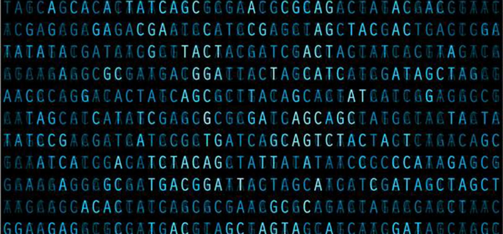

유전체분석실무
================================

국내에서도 이제 개인이 직접 유전자검사를 의뢰하여 자신의 유전체정보를 획득할 수 있는 시대가 도래했다. 이 책은 자신의 유전체 정보의 의미와 자신의 유전체 데이터를 어떻게 분석 할지에 대한 책이다.

.. note::
	이 책을 연습하기 위한 가장 좋은 방법은 현재 해당 git을 사용하는 것입니다.

.. warning::
	본 책에 대한 권리는 모두 hongiiv@gmail.com에게 있습니다.
	무단으로 복제하거나 배포를 금지합니다.

.. tip::
	파이썬과 R에 대한 기본 지식이 필요합니다.	

Contents
========

.. toctree::
   :maxdepth: 2

   perface
   genome_data
   distance
   population
   ancestry
   nipt
   gwas

